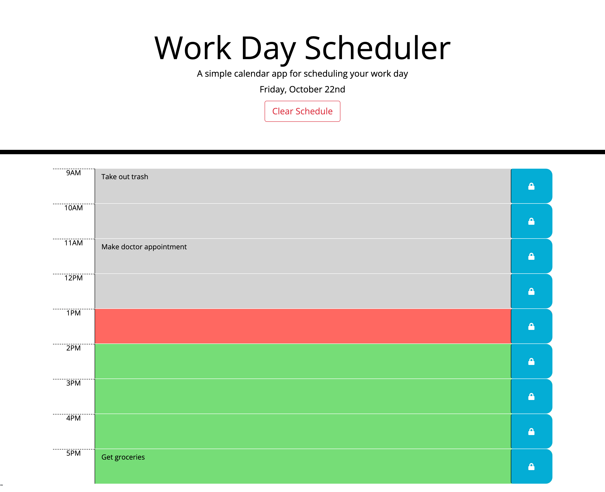

# Work Day Scheduler Starter Code

## Description
* Simple daily schedule app that allows user to list this they need to do that day by hour from 9 a.m. to 5 p.m. 
* The hour blocks will be gray for past hours, red for current hour, and green for future hours. 
* When user adds item to hour block and hits the save button the information will be saved to local storage and reload if page is closed and reopened. 
* If users wishes to there is a clear schedule button that clear all data from local storage and reload page to give user an empty schedule.git

### Languages Used 
HTML, CSS, JQuery, Bootstrap, and Moment.js

## Screen Shot

## Link to Application

https://adamjfield.github.io/WorkDayScheduler-AdamField/